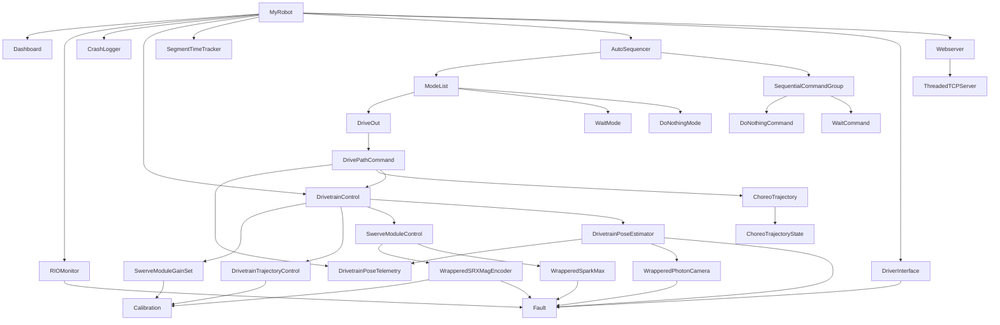

# Class Relationships

```mermaid
flowchart TD
    WrapperedSRXMagEncoder-->Calibration
    DriveOut-->DrivePathCommand
    MyRobot-->Dashboard
    SequentialCommandGroup-->DoNothingCommand
    DrivetrainPoseEstimator-->DrivetrainPoseTelemetry
    RIOMonitor-->Fault
    MyRobot-->RIOMonitor
    DrivePathCommand-->DrivetrainPoseTelemetry
    MyRobot-->CrashLogger
    DrivePathCommand-->ChoreoTrajectory
    DrivetrainPoseEstimator-->WrapperedPhotonCamera
    SwerveModuleControl-->WrapperedSRXMagEncoder
    ModeList-->DriveOut
    AutoSequencer-->ModeList
    ChoreoTrajectory-->ChoreoTrajectoryState
    DrivetrainControl-->SwerveModuleGainSet
    MyRobot-->DrivetrainControl
    MyRobot-->SegmentTimeTracker
    DrivePathCommand-->DrivetrainControl
    MyRobot-->AutoSequencer
    WrapperedPhotonCamera-->Fault
    DrivetrainTrajectoryControl-->Calibration
    DriverInterface-->Fault
    SwerveModuleControl-->WrapperedSparkMax
    WrapperedSRXMagEncoder-->Fault
    DrivetrainControl-->DrivetrainTrajectoryControl
    Webserver-->ThreadedTCPServer
    WrapperedSparkMax-->Fault
    DrivetrainPoseEstimator-->Fault
    ModeList-->WaitMode
    ModeList-->DoNothingMode
    MyRobot-->DriverInterface
    SequentialCommandGroup-->WaitCommand
    SwerveModuleGainSet-->Calibration
    MyRobot-->Webserver
    DrivetrainControl-->SwerveModuleControl
    AutoSequencer-->SequentialCommandGroup
    DrivetrainControl-->DrivetrainPoseEstimator
```
